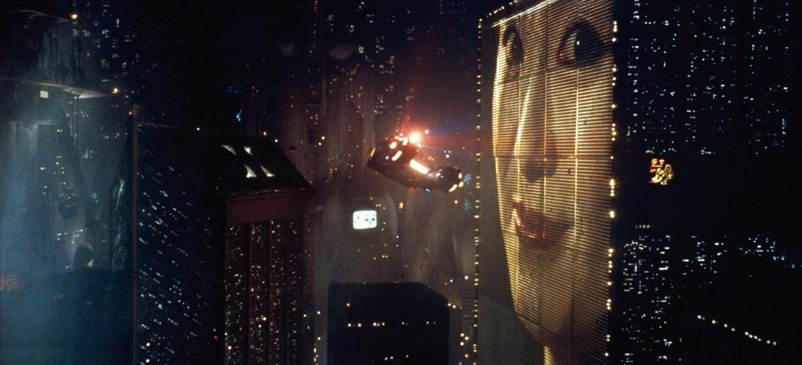
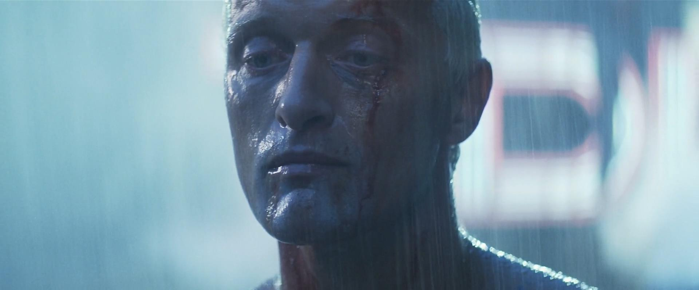

# **Blade Runner - 银翼杀手系列**

> I've seen things you people wouldn't believe. 
> Attack ships on fire off the shoulder of Orion. 
> I watched C-beams glitter in the dark near the Tannhäuser Gate. 
> All those moments will be lost in time, like tears in rain. 
> Time to die.

## 剧情梗概

### 《银翼杀手》（Blade Runner）

这是一个由**复制人**（Replicant）和**人类**（Human）共同生活的世界。复制人是由**泰瑞公司**（Tyrell Corporation）制造的生物工程人造人，外表与普通人类无异，但拥有超强的力量和敏捷性。由于复制人被设计为服从命令且寿命有限（通常为四年），他们被广泛用于危险或单调的工作，如太空殖民地的劳工。然而，随着时间的推移，一些复制人开始表现出自我意识和情感，这引发了社会对他们权利的争议。

**里克·戴克**（Rick Deckard）是一名退休的**银翼杀手**（Blade Runner），专门负责追捕和“退役”逃脱的复制人。当一群高度先进的复制人逃到地球并试图延长他们的寿命时，戴克被迫重新出山，追踪并消灭这些复制人。在这个过程中，他遇到了**瑞秋**（Rachael），一名拥有自我意识的复制人，并与她发展出复杂的关系。

### 《银翼杀手2049》（Blade Runner 2049）

设定在前作三十年后的未来世界，故事围绕一名新的银翼杀手**K**（K）展开，他是一名复制人，负责追捕和“退役”其他复制人。在一次任务中，K 发现了一个被隐藏的秘密：一名复制人曾经生下了孩子，这在复制人中是前所未有的现象。这个发现可能会颠覆人类和复制人之间的关系。K 的调查将他引向了前银翼杀手里克·戴克，他在寻找真相的过程中，逐渐意识到自己的身份和存在的意义。

---

电影探讨了身份、记忆和人性的主题，质疑什么才是真正的“人”。戴克在追捕复制人的过程中逐渐意识到他们的情感和渴望，并开始质疑自己的道德立场。影片以其深刻的哲学思考、视觉风格和氛围而闻名，成为科幻电影的经典之作。

## 主要角色

- **里克·戴克**（Rick Deckard）：银翼杀手，负责追捕逃脱的复制人。
- **瑞秋**（Rachael）：一名拥有自我意识的复制人，与戴克发展出复杂的关系。
- **罗伊·巴蒂**（Roy Batty）：复制人领袖，寻求延长寿命并探索人性的意义。
- **普里斯**（Pris）：复制人，罗伊的同伴，展现出复制人的情感和渴望。
- **艾尔顿·泰瑞**（Eldon Tyrell）：泰瑞公司的创始人，代表了科技的极限和伦理的边界。
- **杰尼·哈克**（J.F. Sebastian）：泰瑞公司的工程师，与复制人有着复杂的关系。
- **布莱恩·杰斯特**（Bryant）：戴克的上司，负责指挥银翼杀手的行动。

## 剧照

| 银翼杀手 | 银翼杀手2049 |
| --- | --- |
|  |  |
|  |  |

## 其他

- [IMDb - Blade Runner (1982)](https://www.imdb.com/title/tt0083658/)
- [IMDb - Blade Runner 2049 (2017)](https://www.imdb.com/title/tt1856101/)
- [豆瓣 - 银翼杀手](https://movie.douban.com/subject/1291546/)
- [Bilibili - 银翼杀手](https://www.bilibili.com/bangumi/play/ep298076)
- [Bilibili - 银翼杀手 2049](https://www.bilibili.com/bangumi/play/ep401765)

