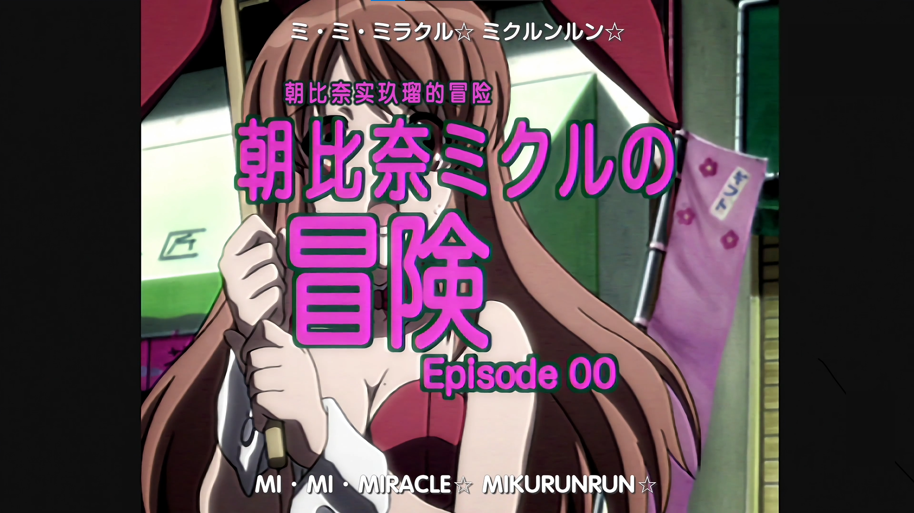
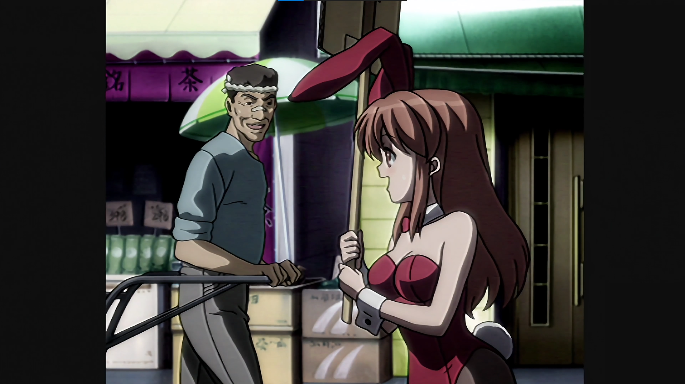
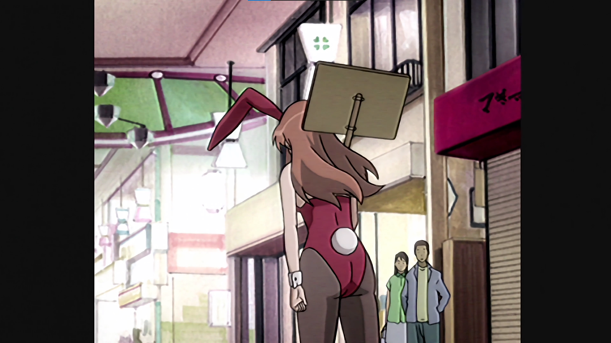
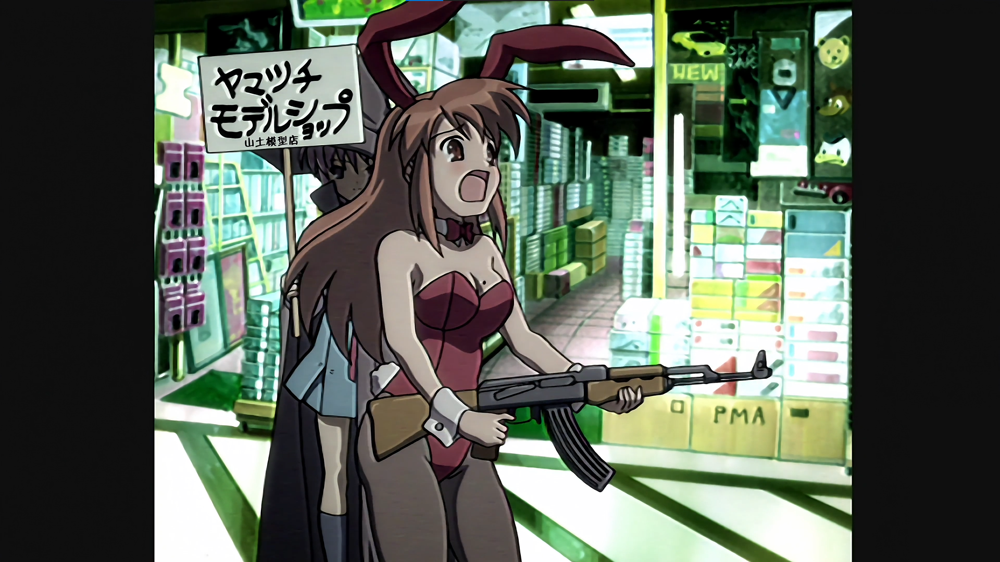
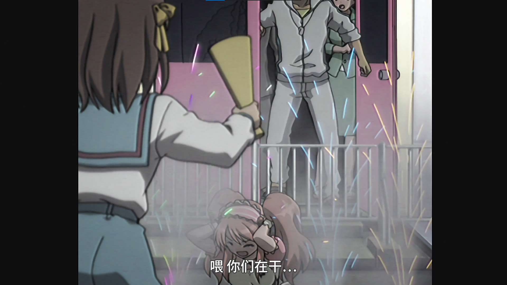
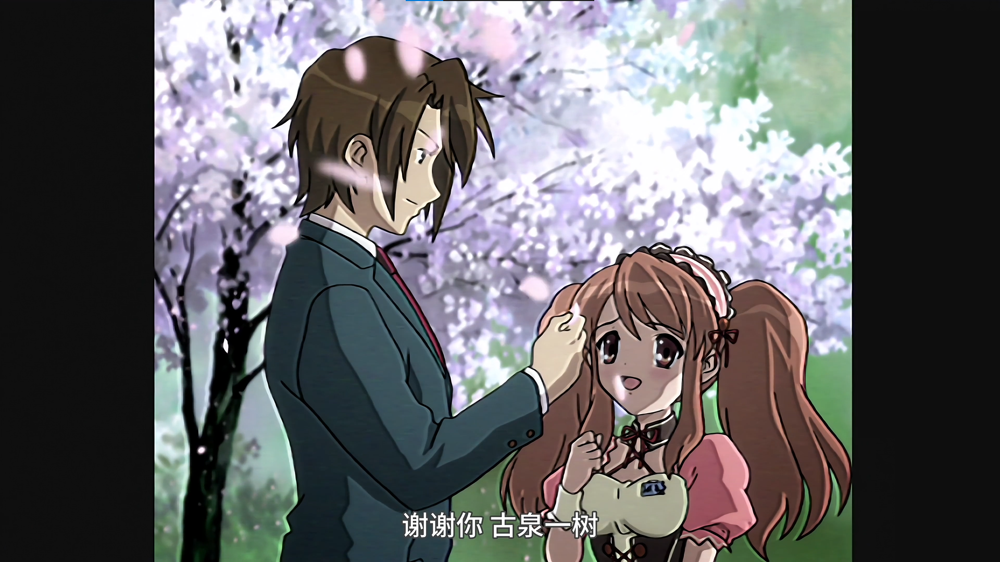

# 涼宮ハルヒは誰

> 老实说，要到几岁才开始不相信圣诞老人的存在……这类无聊的话题对我而言，根本不痛不痒的。不过，讲到<br>
> 从几岁起开始不相信圣诞老人就是那个穿着红衣服的老公公时，我能确定地说，我根本打从一开始就不相信。 <br>
> 我知道幼稚园圣诞节庆祝会时出现的圣诞老人是假的，回溯记忆，还能记起周围的幼稚园小朋友都一脸不信任<br>
> 望着假扮圣诞老人的园长老师。 <br>
> 即使没有撞见老妈正在亲吻圣诞老公公，机灵的我也老早就怀疑只在圣诞节工作的老爷爷是否真的存在了。<br>
> 过，我却是过了很久以后，才发现外星人、幽灵、妖怪、超能力者以及运用特效拍成的动画里头，那些与邪恶<br>
> 织战斗的英雄们并不存在这世上。 <br>
> 不，说不定我早就发现了，只不过一直不想承认而已。因为，在我的内心深处，是十分渴望那些外星人、幽灵<br>
> 妖怪、超能力者以及邪恶组织突然出现在眼前的。 <br>
> 和我生活的这个普通世界相比，运用特效拍成的动画里头所描绘的世界，反而更有魅力。 <br>
> 我也想活在那种世界里！ <br>
> 我真的好想拯救被外星人绑架并关在透明的大型豌豆夹里头的少女；也想拿着雷射枪运用智慧与勇气击退企图<br>
> 写历史的未来人；或者光用一句咒语就收拾了恶灵跟妖怪，再不然就是和秘密组织的超能力者进行超能力的<br>
> 斗！ <br>
> 等等，冷静一下，假设我被外星人等等（以下略）那类的生物袭击，没有任何特殊能力的我怎么可能和他们<br>
> 抗？？于是，我便如是幻想： <br>
> 某天，班上突然转来一个谜样的转学生，他其实是个外星人或未来人那类的生物，并拥有未知的能力，后来他<br>
> 坏人战斗，而我只要设法让自己被卷进那场战争就好了。主要战斗的人是他，而我则是追随他的小跟班。啊啊<br>
> 实在太棒了，我真是聪明啊！ <br>
> 要不然就是这样：某天，我那不可思议的力量突然觉醒，就像隔空取物或精神念力之类的。而且地球上其实还<br>
> 很多拥有超能力的人类存在，自然也会有一个组织专门收容这些人。不久之后，善良的组织便派人来迎接我，<br>
> 我也成为组织的一员，共同对抗企图征服世界的邪恶超能力者。 <br>
> 不过，现实却是意外地残酷。 <br>
> 现实的生活中，并没有半个转学生转来我班上；我也没看过UFO；就算去了地方上常出现幽灵或妖怪的灵异<br>
> 点，也连个鬼影都没有；花了两小时盯着桌上的铅笔，它却连一微米都没移动；上课时死盯着前座同学的头，<br>
> 怎么样也无法读出他在想什么。 <br>
> 我就这样边惊叹世界物理法则经常出现的现象，边不停自嘲，不知从何时起，我就开始不仅对那方面的事情存<br>
> 一丝留恋的程度。 <br>
> 国中毕业之后，我便从那孩提时代的梦想毕业，逐渐习惯这个世界的平凡。而让我还有一缕期待的一九九九年<br>
> 没有发生什么事。进入二十一世纪后，人类依旧无法迈出月球到其他星球去。看这情况，在我还活着的时候，<br>
> 从地球当天往返阿尔法人马座（Alpha Centauri）似乎是不太可能的。 <br>
> 我脑海中时而幻想着这些事，终于也没啥感慨地成为了高中生——直到遇到了凉宫春日。 

---

> 「ただの人は趣味はありません。<br>
> この中に宇宙人、未来人、超能力者がいたら、<br>
> あたしのところに来なさい。以上」

## 凉宫春日的忧郁动画版

是的，在我第一次观看 **凉宫春日的忧郁 2006** 时我就产生了弃坑的念头，那看起来十分具有年代感的

<table>
    <tr>
        <td>第一集开头</td><td>“池沼”演技</td><td><del>“漫八”伏笔</del></td>
    </tr>
    <tr>
        <td></td><td></td><td></td>
    </tr>
    <tr>
        <td>不明所以的广告</td><td>疑似导演的背影</td><td>男主角？</td>
    </tr>
    <tr>
        <td></td><td></td><td></td>
    </tr>
</table>

然而，随着剧情的推进，我发现这部动画的确是有趣的。它不仅仅是一个普通的校园故事，而是充满了奇幻和科幻元素。凉宫春日这个角色非常独特，她的性格和行为让人又爱又恨。

她的强势和自我中心让人感到压迫，但同时她的魅力和神秘感又让人无法抗拒。

她的存在仿佛是为了打破平凡的生活，让人们重新思考什么是真正的“非凡”。

她的故事充满了悬念和惊喜，每一集都让人期待接下来的发展。

官方网站：[https://www.haruhi.tv/](https://www.haruhi.tv/)

---

## 对于原著

待更新

## 作为一个读者或粉丝的愿望

<div style="text-align: center; font-size: 1.4em; font-famliy: none; background-color: white">
  <strong style="color: darkgreen">我想再次看到动画版</strong>
</div>

### 凉宫春日的新动画？

我在看 **[凉宫春日的忧郁 2009](https://www.bilibili.com)** 中实际按照时间线上的最后一集时在
B站的弹幕中看到

当我在看 **[凉宫春日的忧郁 2006](https://www.bilibili.com)** （前有凉宫后有天，乱序播放日神仙）时我在弹幕中看见一段话

在我看完雪山症侯群以后这个愿望就愈发强烈了（也感染了春日病毒），其实从故事中就可以看出以长门为代表的 **宇宙人** 派别斗争的激烈（尽管没有直接的证据）

### 凉宫春日的未来

二零二三年凉宫春日系列新作**《凉宫春日的剧场》**在市场上市，尽管我并没有感染 _春日病毒_ 多久，可我还是愿意为 **谷川流** 捐赠打麻将的钱，现在那本书就放在 **当当网** 的购物车里面。我在网上看了看相关的信息，发现反响并没有前几部好（可能也是意料之中），有人说是炒冷饭（`找到当时的网页`）。

究竟如何等我把原著补完后再说，至于 **\*剧场** 我打算今年十二月十七日再看一遍（第三遍了）

最可惜的是我并不认识未来人、宇宙人以及超能力者吗，更不认识异世界人，阿虚他们的“日常”故事终究与我无缘，更何况本来他们就只是谷川流笔下的任务而已，他们是虚拟的。不过我还是希望有一个如 **1096** 的未来人学姐悄悄地对我说禁止事项。

> “呜呜呜，阿虚，我——”
>
> 朝比奈吸吸鼻子，又继续独白似的呢喃：
>
> “我回不去未来了——”
>
> ......
>
> “呜……我想想……我一直用‘禁止事项’跟未来联系，或是进行‘禁止事项’……呃。大约有一个星期左右，我没收到‘禁止事项’的通知，才觉得有点奇怪。然后‘禁止事项’……我非常惊慌。就尝试进行‘禁止事项’看看。结果完全是‘禁止事项’……呜……呜哇！我该怎么办才好……”
>
> 该怎么办才好？我也不知道哇。那个“禁止事项”是不是什么得消音的禁语？

```bash
读者> “谷川流老师你的新作以及以前的坑什么时候填呢？”
谷川流> “这是禁止事项”
```

看看谷川流在《凉宫春日的惊愕》的后记中所写的东西吧

> ### **后记**
>
> 我是谷川流，抱歉让各位久等了。
>
> 首先，请先让我对‘分裂’后的一大段空白致上深切的歉意。
>
> 明明是前作的直接续集，怎么会拖了那么久？对于如此一个时间上的事实，我实在责无旁贷，除了抱歉还是抱歉。
>
> 因我而深受各种难言之扰的出版相关人员，特别是为本系列作画的いとうのいぢ老师，以及书店各位店员大哥大姐，请听我大声说一句：
>
> 非常对不起——————！
>
> 而我最最最对不起的，就是对拙作不离不弃、苦等多时的各位读者，请接受我用脑内电波发讯器最强功率全方位广播的千百亿个谢意。尽管无凭无据，但我相信能成功接收到的人，身边一定会有“小幸福”降临的。
>
> 再来，我也要对代替作者向各位赔不是的春日磕头下跪，希望捱个几拳就能换得她的原谅。
>
> 本作《凉宫春日的惊愕》前．后集完全是《分裂》的续集。倘若各位读者已将《分裂》的剧情忘得一干二净，请容我在此诚惶诚恐地恳请各位重新稍微浏览一遍再垂青本书，先在此谢过各位了。哎，其实各位也不必那么麻烦，不过各位若真肯那么做，我必会感动得呜咽涕零。当然，那一点儿强制性也没有，敬请自行斟酌。
>
> 那么，究竞为何会拖得这么久呢？老实说，完全没有特殊理由，单纯到我自己都头大。只能说是突然间没来由地下不了笔，拖到连正常生活都有些拮据，还有不少人会不时关心起原因几句，但是我真的毫无头绪。既然连自己都不明白，要向他人解释更是难如登天。
>
> 到了这步田地，再多说什么都只是借口罢了。就像写稿专用的个人计算机前兆全无地连发死亡蓝幕，让心血一次次泡汤；被诡异的恶梦弄得一整天精神不济；惊觉买了数字电视后只看得到模拟讯号节目之类的——
>
> 看吧，果然都是借口。人类最拿手的就是找借口，只不过如果够搞笑，还能当作茶余饭后的话题就是了。
>
> 若要说个极端一点的推测，就是“惰性”这样一项充满脊髓的个人特质，在我目前人生中刚好发挥到了顶点的缘故，而这也是最有可能的原因。
>
> 回想起来，我这大半辈子没半项说出来绝对会受人夸赞的事迹，有的只是一想起来就会丢脸到当场窒息昏倒的愚蠢回忆。想不到我竞然能压抑住找而水泥墙把头撞个稀烂的冲动，真是佩服我自己。其实只是没那个胆吧？
>
> 好了，污染各位耳朵的辩解就到这里为止。即使有些唐突，请各位让我在此讲几句古。距今数年前，我很荣幸地以一位小说家的身分出道了。正确月份我一直记不清楚，就一般而言、感觉而言，好像是2003年6月10日吧，应该和正确日期相差不远。当时给角川sneaker文库编辑部和电击文库编辑部诸位大德添了不少麻烦，我到现在还是很放在心上，这辈子都忘不了吧。只要一想到，撞墙的欲望又会高涨起来。
>
> 多亏了那件事喜田时的我几乎无法想象自己的小说能够上市，更在《凉宫春日的忧郁》和《逃离学校！①》出版时陷入各种骑虎难下的事态，不过那样子其实也没那么糟。我想，那段日子应该是我人生中最勤奋的一段时间吧。
>
> 我充分享受了拿出极限产能发愤图强的感觉，而这种感觉应该也影响到了撰写《凉宫春日的消失》的灵感以及其后带着四溢的创作欲一气呵成地完稿的冲劲，使我相信在不知前景是否乐观时，大胆向前冲通常会是最好的选择。
>
> 说到《消失》，各位看过电影版动画了吗？
>
> 很抱歉让以京都动画公司为首的全体电影制作相关人员，遭逢各种难以言表的操劳和困扰，请接受我头顶一吨重物的深深一鞠躬。能见到拙作在《忧郁》播映结束多年后再度动画化，使我整颗心都是谢意和温情，真是感激不尽。我敢说这世上不会再有更令我感到幸福的动画化企划了，还清各位接受如此没用的原作者献上的无尽谢意。
>
> 虽然我是个意志薄弱、朽木不可雕的小角色，只要我的作品能带给各位读者一丝丝乐趣，那便是我无上的幸福。
>
> 从今以后，我想我仍不会放弃当个老写些怪题材的怪人。我在此祈求各位能继续陪我走下去，也希望有朝一日能填补自己天生的人格缺陷，同时在此替这篇后记收笔。
>
> 那么，就让我们在某年某月某地某某有的没的场合中再次相见吧。
>
> 感谢各位！
>
> 谷川 流
>
> 凉宫春日的惊愕 完
> The Eed

真的要罚钱，最好是免费送我全套小说外加本人的签字。我是真的害怕整个系列的烂尾。

---

从性格以及个人经历来说其实我个人与阿虚有很多相似之处，在我小学不知道是几年级的冬天半夜我得到了我人生中的第一把吉他（尤克里里），他们说这是圣诞礼物。至于那把尤克里里我至今都不会弹，曾经我尝试过去学习它但因为我掌握的学习资料有限（而且当时我还没有电脑），所以也就只会弹个1234567。

> 老实说，要到几岁才开始不相信圣诞老人的存在……这类无聊的话题对我而言，根本不痛不痒的。不过，讲到我从几岁起开始不相信圣诞老人就是那个穿着红衣服的老公公时，我能确定地说，我根本打从一开始就不相信。
>
> 我知道幼稚园圣诞节庆祝会时出现的圣诞老人是假的，回溯记忆，还能记起周围的幼稚园小朋友都一脸不信任地望着假扮圣诞老人的园长老师。
>
> 即使没有撞见老妈正在亲吻圣诞老公公，机灵的我也老早就怀疑只在圣诞节工作的老爷爷是否真的存在了。不过，我却是过了很久以后，才发现外星人、幽灵、妖怪、超能力者以及运用特效拍成的动画里头，那些与邪恶组织战斗的英雄们并不存在这世上。
>
> 不，说不定我早就发现了，只不过一直不想承认而已。因为，在我的内心深处，是十分渴望那些外星人、幽灵、妖怪、超能力者以及邪恶组织突然出现在眼前的。
>
> 和我生活的这个普通世界相比，运用特效拍成的动画里头所描绘的世界，反而更有魅力。
>
> 我也想活在那种世界里！
>
> 我真的好想拯救被外星人绑架并关在透明的大型豌豆夹里头的少女；也想拿着雷射枪运用智慧与勇气击退企图改写历史的未来人；或者光用一句咒语就收拾了恶灵跟妖怪，再不然就是和秘密组织的超能力者进行超能力的战斗！
>
> 等等，冷静一下，假设我被外星人等等（以下略）那类的生物袭击，没有任何特殊能力的我怎么可能和他们对抗？？于是，我便如是幻想：
>
> 某天，班上突然转来一个谜样的转学生，他其实是个外星人或未来人那类的生物，并拥有未知的能力，后来他跟坏人战斗，而我只要设法让自己被卷进那场战争就好了。主要战斗的人是他，而我则是追随他的小跟班。啊啊，实在太棒了，我真是聪明啊！
>
> 要不然就是这样：某天，我那不可思议的力量突然觉醒，就像隔空取物或精神念力之类的。而且地球上其实还有很多拥有超能力的人类存在，自然也会有一个组织专门收容这些人。不久之后，善良的组织便派人来迎接我，而我也成为组织的一员，共同对抗企图征服世界的邪恶超能力者。
>
> 不过，现实却是意外地残酷。
>
> 现实的生活中，并没有半个转学生转来我班上；我也没看过UFO；就算去了地方上常出现幽灵或妖怪的灵异地点，也连个鬼影都没有；花了两小时盯着桌上的铅笔，它却连一微米都没移动；上课时死盯着前座同学的头，却怎么样也无法读出他在想什么。
>
> 我就这样边惊叹世界物理法则经常出现的现象，边不停自嘲，不知从何时起，我就开始不仅对那方面的事情存有一丝留恋的程度。
>
> 国中毕业之后，我便从那孩提时代的梦想毕业，逐渐习惯这个世界的平凡。而让我还有一缕期待的一九九九年也没有发生什么事。进入二十一世纪后，人类依旧无法迈出月球到其他星球去。看这情况，在我还活着的时候，想从地球当天往返阿尔法人马座（Alpha Centauri）似乎是不太可能的。
>
> 我脑海中时而幻想着这些事，终于也没啥感慨地成为了高中生 —— 直到遇到了凉宫春日。

我既没有遇见凉宫春日也没有考上一般的高中，严格来讲，其他少男少女口中的青春已经在我初中毕业时结束了。冈崎朋也是电工，我是什么呢？是流水线工人。


